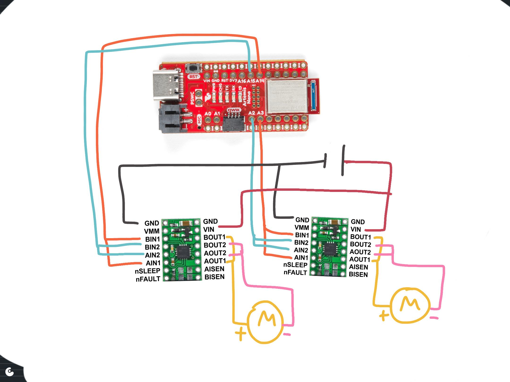

# Max-Desparate-New-Fast-Robots-Site.github.io
I give up on a fancy website (too many hours lost over broken js files) and desparately try to get a new one going. 

# Lab 4

<details>
In this lab, I set up the IMU sensor, enabling 9DOF sensing for the Artemis board. This enables more complex path planning and systems control.


The example code for the IMU board runs without issue out-of-the-box. (The below GIF was recorded retroactively with the example code. The IMU has already been mounted to the robot. The outputs are read from Serial plotter.)


The AD0_VAL value is set to zero by default. This variable refers to the LSB bit of the I2C address. Manipulating the AD0_VAL could allow up to two IMU boards to run in parallel. (Having two of the same board would improve robustness of sensor data.) 

## Accelerometer
Using the equations from class, I record pitch and roll values with the IMU board positioned at -90, 0, and 90 degrees in these two axes.

'''c
pitch_a = atan2(myICM.accY(),myICM.accZ())*180/M_PI;
roll_a  = atan2(myICM.accX(),myICM.accZ())*180/M_PI; 
'''


To get this data, I held the IMU board against the flattest surfaces I had in my room. This brings about potential systematic errors since the flatness and perpendicularity of these surfaces are not guaranteed. This affects my two-point calibration.  

The raw accelerometer data is very noisy. Additionally, at the extreme angles, data for the other axis is most inconsistent. While most of the issue of the accelerometer data is in precision, some of the accuracy is calibrated for by determining a shift and scale factor from the sampled data to fit the expected values to the expected angles. 

```python
# Calculating conversion factors
# Scale conversion
s = 180 / (np.mean(pitch90) - np.mean(pitchneg90))
# origin conversion
o = -(np.mean(pitch90) + np.mean(pitchneg90))/2
print(s,o)
>> 1.0259896646740851 1.0943006994729316
```

Using a fourier transform, I derived an alpha term for low-pass filtering. 


I decided to use 2Hz as my cutoff frequency, leading to the following calculations. 


This leads to a much smoother fourier transform for the filtered signal. In fact, for the low-pass filtered pitch data, only three peaks are registered by the FFT.


Here are the pitches laid on top of one-another. The filtered pitch is clearly much smoother and robust.


## Gyroscope
The gyroscope data suffers from clear drift over time. This is inherent to the sensor, although I found tha higher sampling rates reduced this drift. I suspect this has to do with the dt calculation involved with iterating pitch, roll, and yaw values from gyro data. 


I merged the gyro data with the accelerometer data using a complimentary filter for higher accuracy and precision, with robustness to noise and rapid changes.

I used a beta of 0.9 for these results.


## Sample Data and Stunts
The limiting factor for my sampling rate was waiting on the TOF sensor data. The change I made to boost my sampling rate substantially was to not wait for TOF sensor data when it was not available, and update IMU data first. I used separate float arrays for my variables of interest with a set size of 1400, experimentally determined to be more than enough for 5 seconds of data. 

My sampling rate was much faster when I spent the 5 seconds filling up my data buffers and incrementally sending the data after the recording process was complete. The downside of this setup is that the real runtime is much longer than 5 seconds. 


I cut the cord for the 850mAH battery, the smaller voltage of the two supplied batteries, to be connected to the Artemis. The larger voltage battery is more suited for the high-power demands of the motor controllers. 

I did some basic stunts, with and without the Artemis onboard. 

Without Artemis:


With Artemis:


The following data is from a 5 second capture from the IMU and TOF sensor onboard the robot, run remotely. This particular scene shows me driving the robot 360 degrees in my messy room. Notice the yaw values responding appropriately. Pitch and roll appear to jitter likely due to friction interactions with the floor. Distance sensing also responds appropriately. (I have TOF sensors on either end of the robot.)


</details>

# Lab 5

<details>

## Wiring Diagram

The Artemis voltage requirements for powering are different than that of the motors. The motors draw signficantly more power than the computer. Therefore, a lower voltage battery is suited for running the Artemis computer and a higher voltage batter is suited for running the motors. 

I use analog pins on opposite sides of the Artemis board to control the motor drivers. This makes debugging easier due to the intuitive visual grouping and also reduces likelihood of me shorting connections during the soldering process. 

## Power Supply Testing
A control signal amplitude of 2V best matches the expected output voltage from the Artemis board. For Vin, I used 3.7V to match the maximum output of the charged 850mAh battery. 

I was successfully able to module the speed of the motors on each side using the duty cycle from the function generator. Shorter duty cycles lead to slower rotation.


## Calibration
I added the following code to the bluetooth cases to allow for easy testing and calibration of left and right motors. For a left motor and right motor speed sent over bluetooth, the robot moves forward at those speeds for a second.

```C
case TEST_DRIVE:
    success = robot_cmd.get_next_value(l_speed);
    if (!success)
        return;
    success = robot_cmd.get_next_value(r_speed);
    if (!success)
        return;
    analogWrite(left_f,0);
    analogWrite(left_r,0);
    analogWrite(right_f,0);
    analogWrite(right_r,0);
    delay(500);
    analogWrite(left_f,l_speed);
    analogWrite(left_r,0);
    analogWrite(right_f,r_speed);
    analogWrite(right_r,0);
    delay(1000);
    analogWrite(left_f,0);
    analogWrite(left_r,0);
    analogWrite(right_f,0);
    analogWrite(right_r,0);
    break;
```
Straight line driving was achieved at 190 and 248 for left and right motors respectively. 


## Lower Limit PWM
Running the calibration script at progressively lower and lower PWM values, I found that values at 40 were the threshold for overcoming static friction in driving straight. Intuitively, the fixed 4-wheel drivetrain would experience emore friction in turns. For a point-turn, the minimum viable PWM value was 100 for each motor. 

## Open-loop Test Run
Here is the robot performing a manuever untethered and via a bluetooth command. 

```C
case LAB5:
    l_speed = 190;
    r_speed = 248;
    analogWrite(left_f,l_speed);
    analogWrite(left_r,0);
    analogWrite(right_f,r_speed);
    analogWrite(right_r,0);
    delay(500);
    analogWrite(left_f,l_speed);
    analogWrite(left_r,0);
    analogWrite(right_f,0);
    analogWrite(right_r,0);
    delay(500);
    analogWrite(left_f,0);
    analogWrite(left_r,l_speed);
    analogWrite(right_f,0);
    analogWrite(right_r,l_speed);
    delay(500);
    analogWrite(left_f,0);
    analogWrite(left_r,0);
    analogWrite(right_f,0);
    analogWrite(right_r,l_speed);
    delay(500);
    analogWrite(left_f,0);
    analogWrite(left_r,0);
    analogWrite(right_f,0);
    analogWrite(right_r,0);
    break;
```
</details>

# Lab 6

<details>


## Data Handling
To maximize the customizability of my PID stunt code, I used many input parameters sent over bluetooth. This helped me quickly test different PID parameters as well as other parameters relevant to the stunt. 

My code takes up to 10 inputs. Some parameters operate as 'optional' parameters. 
```C
success = robot_cmd.get_next_value(kp);
            if (!success)
                return;
            success = robot_cmd.get_next_value(ki);
            if (!success)
                return;
            success = robot_cmd.get_next_value(kd);
            if (!success)
                return;
            success = robot_cmd.get_next_value(timeout);
            if (!success)
                return;
            success = robot_cmd.get_next_value(split);
            if (!success)
                split = 10;
            success = robot_cmd.get_next_value(I_gaurd);
            if (!success)
                I_gaurd = 100;
            success = robot_cmd.get_next_value(bottom);
            if (!success)
                bottom = 50;
            success = robot_cmd.get_next_value(forward);
            if (!success)
                forward = 500;
            success = robot_cmd.get_next_value(l_speed);
            if (!success)
                l_speed = 250;
            success = robot_cmd.get_next_value(r_speed);
            if (!success)
                r_speed = 250;         
```

I also used code from my IMU lab to retrieve data after recording. The most efficient way I've found to send batches of data over bluetooth is to store data to several float buffers during the run. Then, once the run is finished, send data line-by-line to a python list over bluetooth.

I can use the following callback function to process and display the data.
```python
def getData(uuid,y):
    global record
    string = y.decode("utf-8")
    if string == "DONE":
        for key in record:
            plt.plot(record[key])
            plt.title(key)
            plt.show()
        return
    datas = string.split("+")
    keys = list(record.keys())
    for data in datas:
        dat = data.split("|")
        for i,e in enumerate(dat):
            if e:
                record[keys[i]] += [float(e)]
ble.start_notify(ble.uuid['RX_STRING'], getData)
record = {"yaws":[],"output":[],"kpP":[],"kiI":[],"kdD":[]}
```

## PID 
In selecting my K values, I followed the heuristic plan laid out in lectures. I first tested a P-only system. When my P value was too high, I found that the robot would turn too fast for yaw readings to be accurate. At a certain point, especially when the robot was within 10 degrees of the set point, it struggled to overcome friction. That led me to introduce a non-zero Ki to eventually build up the magnitude of the output to overcome the friction near the setpoint. I then played with small Kd values to help improve speed of convergence. 

## Sampling
I played with the idea of truncating the yaw data to a 0-360 range. However, I found issues with the robot spinning too far past the setpoint. This is because, for a setpoint of 0, the function of P would be discontinuous. 

Therefore, I had better results with a setpoint of 180 degrees and performing no truncation on yaw. The robot does not spin far enough to encounter issues with data overflow or underflow. 

Even with my code optimized to run as fast as possible, I frequently had issues with my yaw reading accuracy. When the motors are driven too quickly, the robot easily overshoots in reality, but the sensor does not pick up on the overshoot. I suspect this has to do with a breakdown of small angle approximations as high enough angular speeds. Thus, I had to reduce my Kp and I gaurd values to reduce instances of extremely fast spinning. 

## Simple anti-windup
My implementation of anti-windup is a simple hack that truncates the integral tracking variable to a set range. 
```C
I += P * dt;
I = fmax(fmin(I,I_gaurd),-I_gaurd); // anti windup
```

## PID output to motor drivers
To convert the PID output value to integers I can send to the motor drivers, I did the following. I added a baseline speed to the output called "bottom". I then clamped to output to 0-255. I also apply a "split" to account for different efficiencies between the left and right motors. The output value can be negative, reflecting different directions of turning. I converted these real float values to positive integers and wrote them to the appropriate pins of the motor drivers. 

```C
if (output < 0) {
    analogWrite(left_f,0);
    analogWrite(left_r,(int) -fmax(output-bottom+split,-255));
    analogWrite(right_f,(int) -fmax(output-bottom-split,-255));
    analogWrite(right_r,0);
    buff0[counter] = (int) -fmax(output-bottom+split,-255);
    
} else {
    analogWrite(left_f,(int) fmin(output+bottom-split,255));
    analogWrite(left_r,0);
    analogWrite(right_f,0);
    analogWrite(right_r,(int) fmin(output+bottom+split,255));
    buff0[counter] = (int) fmin(output+bottom-split,255);
```

Driving in the hallway, the robot begins to turn and converge toward 180 degrees.


The PWM values that the motors experience look like this.


This output can be broken down into the trends of Kp\*P, Ki\*I, and Kd\*D.


</details>

<!-- # Lab 7

<details>

## Data capture
In the Upson lab, I ran a modified version of the TOF lab code to get step response data. I drove the motors at a set speed for 1 second before letting the robot coast and letting drag slow the robot to a stop.

For easier conversion of u to pwm values, I ran the step response at the maximum PWM value that would allow for straight driving.

Most critically, it was important to set the robot far enough for the robot to come to a rolling stop without collision.


I processed the data to derive velocity and acceleration measurements. I used symmetric moving averages just to smooth out the data. Without the smoothing, errors from the distance measurements propogate through the differentiation. With a little bit of smoothing, I am much more confident in reading the graphs for rise time.

```python
import numpy as np
def moving_average(x, w):
    return np.convolve(x, np.ones(w), 'same') / w

xdot = moving_average(np.ediff1d(x)/np.ediff1d(times),3)
```


Here we can see the robot move towards the wall with nearly continuous acceleration and increasing speed. After 1 second from the start of data capture, acceleration reverses direction and a lower magnitude acceleration at a point in time that matches the inflection point in the X data.

## Drag and Mass
After this, the process of capturing the 90% rise time is relatively simple implementation of the lecture code. 
```python
# d ~ 1/xdot_steady
xdot_steady = np.min(xdot)
d = (-1/xdot_steady)

xdot90 = 0.9*xdot_steady
t_rise = (times[np.argmax(xdot < xdot90)] - times[0]) 

# m = -d*t_0.9 / ln(0.1)
m = -d*t_rise / np.log(0.1)

print(d, m)
>> 0.6709160379958043 264.7416977038248
```

## A and B matrices
With my coefficients determined, I then calculate my A, B, and C matrices. I also discretize A and B as required. 
```python
# xdot = Ax + Bu
A = np.array([[0,1],[0,-d/m]])
B = np.array([[0],[1/m]])

C = np.array([[-1,0]])

#discretized, dt is sampling time
dt = (times[-1] - times[0]) / len(times)
Ad = np.eye(len(A)) + dt * A  
Bd = dt * B

A = Ad
B = Bd
```


|  A  |         |
|----|---------|
| 1 | 97.32545098 |
| 0 | 0.75335504 |

|  B  |
|----|
| 0. | 
| 0.36762419 |

|  C  |         |
|----|---------|
| -1 | 0 |

## Applying Kalman Filter
Then, it is a matter of applying the kalman filter with the kalman filter function on the measured data.

We use this function applied to a given motor input u and measured output state y.
```python
sigma_1, sigma_2, sigma_3 = dt, dt, 27.

sig_u=np.array([[sigma_1**2,0],[0,sigma_2**2]]) 
sig_z=np.array([[sigma_3**2]])

sigma = np.array([[2500,0],[0,10]])


def kf(mu,sigma, u, y):
    mu_p = A.dot(mu) + B.dot(u)
    sigma_p = A.dot(sigma.dot(A.transpose()))+sig_u
    
    sigma_m = C.dot(sigma_p.dot(C.transpose()))+sig_z
    kkf_gain = sigma_p.dot(C.transpose().dot(np.linalg.inv(sigma_m)))
    
    y_m = y-C.dot(mu_p)
    mu = mu_p+kkf_gain.dot(y_m)
    sigma=(np.eye(2)-kkf_gain.dot(C)).dot(sigma_p)

    return mu, sigma
```

I first tested the following sigmas. My position and speed standard deviation is about 9.9. I try 20 for my sigma_3 process noise. 

```python
sigma_1, sigma_2, sigma_3 = np.sqrt(dt), np.sqrt(dt), 20.


sig_u=np.array([[sigma_1**2,0],[0,sigma_2**2]]) 
sig_z=np.array([[sigma_3**2]])

sigma = np.array([[2500,0],[0,10]])
```

I used the below code to visualize the filtered data
```python
kf_state = []
x_ = -np.array([x[1],0]).transpose()
Y = -np.stack([x[1:],xdot[0:]]).transpose()
u = 1
for i,y in enumerate(Y):
    if i == np.argmin(x)-1:
        u = 0
    x_, sig = kf(x_, sigma, [[u]], y)
    kf_state.append(x_)

kf_state = np.stack(kf_state)
plt.plot(kf_state[:,0,1],label="Kalman Filtered")
plt.plot(xdot[1:], label="Raw")
plt.legend()
plt.show()
```

The results show the filtered data means consistently overshooting measured results, resulting in the robot appearing to be closer to the wall than it is in the measured data. If anything, with the doppler effect, appearing slightly further from the wall would be more reasonable.


To induce a somewhat tighter fit, I increase sigmas in my process values. 
I use 97.3, 9.9, and 50 for my sigmas 1 through 3. And I use 2.5 and 243 for m


## Onboard extrapolation

To interpolate between TOF readings on the Artemis, I use my last readings of x and xdot to linearly extrapolate into the future. This allows me to have a finer sampling rate. 

After capturing the initial state with the TOF sensor, I am able to begin applying the extrapolation to incoming data. When real sensor data is not available, the Artemis falls back on, every 15 milliseconds, at a much faster sampling rate, a best guess of position and speed to predict the present state. 

```C
while (true) {
    if (distanceSensor1.checkForDataReady()) {
        last_time = millis();
        distance1 = distanceSensor1.getDistance();
        distanceSensor1.clearInterrupt();
        distanceSensor1.stopRanging();
        distanceSensor1.startRanging();
        x_(0,0) = distance1;
        break;
    }
    delay(5);
}

analogWrite(right_f,r_speed);
analogWrite(right_r,0);
analogWrite(left_f,l_speed);
analogWrite(left_r,0);

while (counter < buffer_size) {
    timestamp = micros();
    if (timestamp - last_time2 > timeout) {
        analogWrite(right_f,0);
        analogWrite(right_r,0);
        analogWrite(left_f,0);
        analogWrite(left_r,0);
        u(0) = 0;
        if (timestamp - last_time2 > 5000000) {
            break;
        }
    }

    if (distanceSensor1.checkForDataReady()) {
        distance1 = distanceSensor1.getDistance();
        distanceSensor1.clearInterrupt();
        distanceSensor1.stopRanging();
        distanceSensor1.startRanging();

        if (counter > 0) {
            dt = millis() - last_time;
            last_time += dt;
            xdot = (distance1 - buff0[last_counter]) / dt;
            last_counter = counter;
        }
        
        y = {distance1,xdot};

        times[counter] = timestamp/1000.;
        distance1 = y(0,0);
        buff0[counter] = distance1;
        buff1[counter] = y(0,1);
        counter++;
        }

    delay(15); // Fallback interpolation
    times[counter] = timestamp/1000.;
    distance1 += 15*y(0,1);
    buff0[counter] = distance1;
    buff1[counter] = y(0,1);
    counter++;

}
```

Here are the results of the interpolation in a sample run. The x axis shows the number of samples. The linear interpolation strategy works very well during most of the motion. However, where the magnitude of velocity is changing much faster, near the start and end of the robot's motion, the constant speed assumption breaks down. 


</details>

# Lab 8

<details>

## Overview
I chose to perform Task B: Orientation Control. For this task, I will program the robot to drive fast toward a wall, drift and turn 180 degrees and drive back. 

## Best run

In my best run, my robot completes the task in about 4 seconds. 

## Blooper reel
[](https://www.youtube.com/watch?v=L2kpKNiJ4Ls)

## Implementation
For this high speed task, I must face a few specific challenges. I am aware that the robot's yaw measurement is inaccurate at fast rotations. It may be necessary to compensate for expected drift by programming the turn setpoint as required. 

My code consists of three loops that the robot progresses through. First, the robot drives forward until it detects a forward distance less than 914 mm (3 feet). Then it initates a 180 degree turn using PID. Finally, it drives straight back to the finish line. At every stage, there exists a timeout in the case that any phase hangs for any technical reason. This helps prevent the robot from behaving too erratically and getting damaged.

For faster distance updates, I use linear extrapolation to estimate distance when the ToF data is unavailable. Below is the code for phase 1.  I found that setting *distance_to_wall* to values higher than 914 mm gives the robot enough distance to respond, giving enough space for the arc of the turn. Otherwise the robot ends up crashing into the wall. 
```python
while (distance1 > distance_to_wall) {
    timestamp = micros();
    if (timestamp - last_time2 > timeout || counter >= buffer_size) {
    analogWrite(right_f,0);
    analogWrite(right_r,0);
    analogWrite(left_f,0);
    analogWrite(left_r,0);
    if (timestamp - last_time2 > 5000000) {
        break;
    }
    }

    if (distanceSensor1.checkForDataReady()) {
    distance1 = distanceSensor1.getDistance();
    distanceSensor1.clearInterrupt();
    distanceSensor1.stopRanging();
    distanceSensor1.startRanging();

    if (counter > 0) {
        dt = millis() - last_time;
        last_time += dt;
        xdot = (distance1 - buff0[last_counter]) / dt;
        last_counter = counter;
    }
    
    times[counter] = timestamp/1000.;
    buff0[counter] = distance1;
    buff1[counter] = xdot;
    counter++;
    }

    delay(15);
    times[counter] = timestamp/1000.;
    distance1 += 15*xdot;
    //buff0[counter] = distance1;
    //buff1[counter] = xdot;
    //counter++;

}
```

And here is phase 2. This code is largely unchanged from the PID lab. Having a setpoint other than 180 gave me flexibility in adjusting for yaw overshoot or undershoot. 
```python
last_time = micros();

while (counter < buffer_size) {
    // if data ready and past minimum update time
    Serial.println(counter);
    if(myICM.dataReady())
    {
    // collect data
    myICM.getAGMT();
    timestamp = micros();
    dt = (timestamp - last_time2)/1000000.;
    last_time2 = timestamp;
    yaw_g += myICM.gyrZ()*dt;

    yaws[counter] = yaw_g;

    // calculate P error
    P = set_point - yaw_g;

    // calculate I error
    I += P * dt;
    I = fmax(fmin(I,I_gaurd),-I_gaurd); // anti windup

    // calculate D error
    D = (P - P_prev) / dt;
    P_prev = P;

    // calculate output, 
    output = kp * P + ki * I + kd * D;
    //buff0[counter] = output;
    buff1[counter] = kp*P;
    buff2[counter] = ki*I;
    buff3[counter] = kd*D;

    counter++;

    // clamp output 
    if (output < 0) {
        
        analogWrite(right_f,0);
        analogWrite(right_r,(int) -fmax(output-bottom+split,-255));
        analogWrite(left_f,(int) -fmax(output-bottom-split,-255));
        analogWrite(left_r,0);
        //buff0[counter] = (int) -fmax(output-bottom+split,-255);
        //buff2[counter] = l_speed;
        
    } else {
        analogWrite(right_f,(int) fmin(output+bottom-split,255));
        analogWrite(right_r,0);
        analogWrite(left_f,0);
        analogWrite(left_r,(int) fmin(output+bottom+split,255));
        //buff0[counter] = (int) fmin(output+bottom-split,255);
        //buff1[counter] = r_speed;
        //buff2[counter] = l_speed;
    }

}
```

And finally, I have a final drive forward script for phase 3. This part is the most straightforward.
```python
 if (timestamp - last_time > timeout) {
    delay(5);
    analogWrite(right_f,r_speed);
    analogWrite(right_r,0);
    analogWrite(left_f,l_speed);
    analogWrite(left_r,0);
    delay(forward);
    analogWrite(right_f,0);
    analogWrite(right_r,0);
    analogWrite(left_f,0);
    analogWrite(left_r,0);
    break;
    }
```

## PID and task Settings
* Kp = 0.2
* Ki = 0.007
* Kd = 0.02
* Timeout setting = 0.8 seconds
* Setpoint = 90 degrees

## Plots
I plot data captured from my best run. When the data shows zero, that indicates that the data isn't captured for phase 1. 


</details>

# Lab 9

<details>

For the mapping task, I chose to repurpose my PID orientation control code to perform orientation control. I perform PID on position setpoints around a 360 degree turn. Specifically, in time windows of about a second, a running record of the set point position gets iterated up by 24 degrees, or a 15th of a full turn. The robot performs PID to try to reach that set point. After the time window is over, a measurement is taken of the distance from both time of flight sensors (mounted perpendicular to eachother) and of the current yaw reading. The yaw reading is known to be pretty inaccurate for rotations that are too fast, so I keep the kP term relatively small. 

The functional Arduino code looks something like this.

```C
yaws[counter] = yaw_g;
analogWrite(right_f,255);
analogWrite(right_r,255);
analogWrite(left_f,255);
analogWrite(left_r,255);
delay(50);

target += 360/15;

distanceSensor0.startRanging();
while (true) {
if (distanceSensor0.checkForDataReady()) {
distance0 = distanceSensor0.getDistance();
distanceSensor0.clearInterrupt();
distanceSensor0.stopRanging();
d0s[counter] = distance0;
break;
}
delay(5);
}

distanceSensor1.startRanging();
while (true) {
if (distanceSensor1.checkForDataReady()) {
distance1 = distanceSensor1.getDistance();
distanceSensor1.clearInterrupt();
distanceSensor1.stopRanging();
d1s[counter] = distance1;
break;
}
delay(5);
}

counter++;
```

Once I resolve the bluetooth connection issues, the code runs smoothly and captures and sends data well over bluetooth. The code for the data transfer is recycled from other labs. 


## Robot Spinning
I struggled to get the robot to turn in place, even while using duct-taped wheels. In addition, the ToF sensors are also offset from the center of the robot. Finally, there is likely a discrepency between the yaw the robot measures and the actual yaw.

I try to later account for these offsets in my plotting of my datapoints. This is explained in the next sections.

## Plots
When I recieve raw data from the data callback, I recieve data for yaw, distance0, and distance1. 


I then convert this data to polar plots after yaws are converted to radians.


## Precision and repeatability
Running the same code twice at a given location produces data that is surprisingly similar. This data is without any additional processing. This result occurs inspite of the fact that the starting position of the robot is not carefully controlled and the fact that the robot does not turn on its own axis. 


## Combining maps
From yaw and distance measurement data, we can convert polar coordinates to planar coordinates. I used the expression *x = r\*cos(theta) + x_o* and *y = r\*sin(theta) + y_o* to transform the data to a form that can be superimposed onto eachother. *x_o* and *y_o* refer to the respective origins at which the data was collected in the map. 

In python, the resultant code looks like this:

```python
import numpy as np
import matplotlib.pyplot as plt

keys = [["neg3neg2",-3,-2],["03",0,3],["53",5,3],["5neg3",5,-3]]

for name, delx, dely in keys:
    r = np.load(name+"r1.npy")+75
    theta = np.load(name+"theta.npy")
    x = (r)*np.cos(theta/180*np.pi+1*np.pi/2)/304.8+delx
    y = (r)*np.sin(theta/180*np.pi+1*np.pi/2)/304.8+dely
    plt.plot(x,y, ".",)
    plt.plot([delx], [dely], "x", label =  name)
plt.legend()
plt.show()
```
Thetas are offset by 90 degrees to account for my starting position. And distances are scaled to imperial units. 


From the unprocessed map of the raw data, we can see an overall outline of the room and dots in the vague positions of the boxes within the room. To get more out of my data, I account for the fact that my ToF sensor travels a radius away from my center of rotation. Additionally, when my robot thinks it has completed a 360 degree turn, more often the turn is closer to 340. We can scale theta to try to correct this, too.

Adjusting the data to better fit, accounting for different offsets, and radii of rotation, and incomplete turns, I am able to produce a much cleaner joint point cloud.

```python
keys = [["neg3neg2",-3,-2, 'red'],["03",0,3, 'green'],["53",5,3,'blue'],["5neg3",5,-3,'purple']]
for name, delx, dely, color in keys:
    r = np.load(name+"r1.npy")
    theta = np.load(name+"theta.npy")
    if name == "03":
        x = (r+25)*np.cos(theta*(165/180)/180*np.pi+np.pi/2+0.4)/304.8+delx
        y = (r+25)*np.sin(theta*(165/180)/180*np.pi+np.pi/2+0.4)/304.8+dely+0.3
    elif name == "53":
        x = (r+65)*np.cos(theta*(200/180)/180*np.pi+np.pi/2-0.6)/304.8+delx
        y = (r+65)*np.sin(theta*(200/180)/180*np.pi+np.pi/2-0.6)/304.8+dely
    elif name == '5neg3':
        x = (r+75)*np.cos(theta*(170/180)/180*np.pi+np.pi/2-0.)/304.8+delx
        y = (r+75)*np.sin(theta*(170/180)/180*np.pi+np.pi/2-0.)/304.8+dely
    else:
        x = (r+115)*np.cos(theta*(170/180)/180*np.pi+np.pi/2-0.1)/304.8+delx
        y = (r+115)*np.sin(theta*(170/180)/180*np.pi+np.pi/2-0.1)/304.8+dely
    plt.plot(x,y, ".", color=color)
    plt.plot([delx], [dely], "x", color=color, label =  name)
plt.legend()
plt.show()
```


I can draw the predicted room boundaries using horizontal and vertical lines. I construct these lines under the basic assumption that all boundaries are strictly horizontal and vertical. For a vertical line, for example, I take a set of points, and draw a vertical line at *x = x_mu* where *x_mu* is the sample mean x position.

```python
p = np.stack(points, 1).reshape((2,-1))
plt.plot(p[0],p[1],".")

s = p[:,p[0,:]>6.1]
f = np.array([[min(s[1]),np.mean(s[0])],[max(s[1]),np.mean(s[0])]]).transpose()
#plt.plot(s[0], s[1],".")
plt.plot(f[1], f[0])

s = p[:,p[1,:]>3.5]
f = np.array([[np.mean(s[1]),np.min(s[0])],[np.mean(s[1]),np.max(s[0])]]).transpose()
#plt.plot(s[0], s[1],".")
plt.plot(f[1], f[0])

s = p[:,p[0,:]>-3]
s = s[:,s[0,:]<-2]
s = s[:,s[1,:] > 0.]
f = np.array([[min(s[1]),np.mean(s[0])],[max(s[1]),np.mean(s[0])]]).transpose()
#plt.plot(s[0], s[1],".")
plt.plot(f[1], f[0])

#...
```


## Prepping for simulator
From these points, it is a simple to connect adjacent points to build a numpy array of vertices throughout the environment for later use in the simulator.


</details>

# Lab 10 -->

<details>

Code is adapted and optimized from Aarya Pai's 2022 lab work.

Here is the complete run with Bayes filter applied on a trajectory through the simulated environment.


## Inferences and results
The Bel index peaks at a probability of aroud 0.5, but most of the time resides below 0.2. Error is smallest around when the robot moves relatively consistently and at short distances. Large movements especially with a lot of rotation reintroduce the most error. Interestingly, the GT alpha appears to grow substantially over the course of the trajectory. This may be an error with the simulator, given that we expect angles to be constrained -180 to 180. This is room for further investigation in future labs. 


## compute_control
To clean up my code for readability, I create delta_x and delta_y which is passed to the numpy arctan2 function. I use numpy functions where possible to leverage the package's computational speed advantage. I also take advantage of the array and matrix operations in calculating delta_trans. 
```python
def compute_control(cur_pose, prev_pose):
    """ Given the current and previous odometry poses, this function extracts
    the control information based on the odometry motion model.

    Args:
        cur_pose  ([Pose]): Current Pose
        prev_pose ([Pose]): Previous Pose 

    Returns:
        [delta_rot_1]: Rotation 1  (degrees)
        [delta_trans]: Translation (meters)
        [delta_rot_2]: Rotation 2  (degrees)
    """
    delta_x = cur_pose[0] - prev_pose[0]
    delta_y = cur_pose[1] - prev_pose[1]
    delta_rot_1 = mapper.normalize_angle(np.rad2deg(np.arctan2(delta_y, delta_x) - prev_pose[2]))
    delta_trans = np.sum((np.array(cur_pose[:2]) - np.array(prev_pose[:2 ]))**2)**0.5
    delta_rot_2 = mapper.normalize_angle(cur_pose[2] - prev_pose[2] - delta_rot_1)

    return delta_rot_1, delta_trans, delta_rot_2
```

## odom_motion_model
np.product can be used to take the product across all entries in an array. I used this fact to reduce unnecessary indexing. 

```python
def odom_motion_model(cur_pose, prev_pose, u):
    """ Odometry Motion Model

    Args:
        cur_pose  ([Pose]): Current Pose
        prev_pose ([Pose]): Previous Pose
        (rot1, trans, rot2) (float, float, float): A tuple with control data in the format 
                                                   format (rot1, trans, rot2) with units (degrees, meters, degrees)


    Returns:
        prob [float]: Probability p(x'|x, u)
    """  
    u_hat = compute_control(cur_pose, prev_pose)
    sigma = np.array((loc.odom_rot_sigma, loc.odom_trans_sigma, loc.odom_rot_sigma))
    prob = np.product(loc.gaussian(u_hat, np.array(u), sigma))
    
    return prob
```

## prediction_step

I experimented with matrix operations and other numpy tools to reduce the runtime of this function further. I was not successful in finding an alternative outside of the 6 for-loops that worked for my case. The main challenge is the need to apply the belief update between every combination of previous and current poses. With larger environments, this significantly reduces the performance of the Bayes filter, given that the sum connections follows the pyramid numbers formula *n(n+1)/2* or approximately O(n**2).

Here, I also experimented with adding a small epsilon to the division to prevent division errors. In practice, I did not run into issues with the normalization.

```python
def prediction_step(cur_odom, prev_odom):
    """ Prediction step of the Bayes Filter.
    Update the probabilities in loc.bel_bar based on loc.bel from the previous time step and the odometry motion model.

    Args:
        cur_odom  ([Pose]): Current Pose
        prev_odom ([Pose]): Previous Pose
    """
    
    actual_u = compute_control(cur_odom, prev_odom)
    loc.bel_bar = np.zeros((mapper.MAX_CELLS_X, mapper.MAX_CELLS_Y, mapper.MAX_CELLS_A))
    for x_prev in range(mapper.MAX_CELLS_X):
        for y_prev in range(mapper.MAX_CELLS_Y):
            for a_prev in range(mapper.MAX_CELLS_A):
                if loc.bel[x_prev,y_prev,a_prev] > 0.0001:
                    for x_t in range(mapper.MAX_CELLS_X):
                        for y_t in range(mapper.MAX_CELLS_Y):
                            for a_t in range(mapper.MAX_CELLS_A):
                                loc.bel_bar[x_t,y_t,a_t] += loc.bel[x_prev,y_prev,a_prev] * odom_motion_model(mapper.from_map(x_t,y_t,a_t),mapper.from_map(x_prev,y_prev,a_prev),actual_u)

    loc.bel_bar /= np.sum(loc.bel_bar)#+0.00001   
```

## sensor_model and update_step
These functions are pretty lean as-is. I could not make improvements here.
```python
def sensor_model(obs):
    """ This is the equivalent of p(z|x).

    Args:
        obs ([ndarray]): A 2D array consisting of the true observations for each robot pose in the map 

    Returns:
        [ndarray]: Returns a 1D array of size N (total number of cells in the map) with the likelihoods of each cell's observations
    """
    return np.array([loc.gaussian(loc.obs_range_data[i], obs[i], loc.sensor_sigma) for i in range(mapper.OBS_PER_CELL)])


def update_step():
    """ Update step of the Bayes Filter.
    Update the probabilities in loc.bel based on loc.bel_bar and the sensor model.
    """
    for x_t in range(mapper.MAX_CELLS_X):
        for y_t in range(mapper.MAX_CELLS_Y):
            for a_t in range(mapper.MAX_CELLS_A):
                loc.bel[x_t,y_t,a_t] = loc.bel_bar[x_t, y_t, a_t] * np.prod(sensor_model(mapper.obs_views[x_t,y_t,a_t]))
                
    loc.bel /= np.sum(loc.bel)
```


</details>